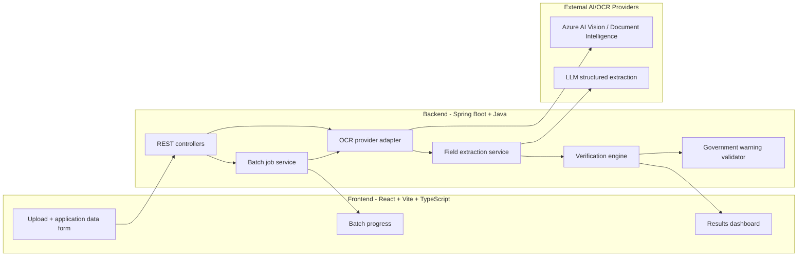

# AI-Powered Alcohol Label Verification App - Implementation Plan

Updated: May 16, 2026

## 1. Project Goal

Build a standalone proof-of-concept that helps TTB compliance agents compare alcohol label artwork against application data. The app should extract label text from uploaded images, identify required label fields, compare those fields to expected application values, and return a clear pass/fail/review result that an agent can act on quickly.

This is a decision-support prototype, not a final legal compliance engine. It should reduce routine matching work while preserving human review for low-confidence OCR, ambiguous matches, or fields that require regulatory judgment.

The prototype is shaped by four stakeholder voices from the brief:

- **Sarah Chen**, Deputy Director of Label Compliance - needs throughput, a 5-second response target, and batch support for bulk importers.
- **Marcus Williams**, IT systems administrator - needs Azure-aligned services and respect for FedRAMP/firewall constraints.
- **Dave Morrison**, senior compliance agent - needs the tool to handle the nuance of obvious-equivalent text differences without false rejections.
- **Jenny Park**, junior compliance agent - needs strict government warning enforcement and tolerance for imperfect label photography.

Each major design choice in this plan is traceable to at least one of these voices.

## 2. Requirements From The Brief

### Core User Needs

| Requirement | Source in brief | Product implication |
|---|---|---|
| Results must be fast enough for agents to use | Prior vendor took 30-40 seconds; target is about 5 seconds | Single-label verification should return in under 5 seconds on normal images. Batch uploads should start quickly and show progress instead of blocking. |
| Agents vary widely in technical comfort | "Something my mother could figure out" | UI must be obvious, accessible, and low-clutter. Avoid hidden controls, jargon, or multi-step setup. |
| Routine field matching is the pain point | Agents compare label artwork to application fields | Prioritize accurate extraction and comparison for required fields over broad regulatory analysis. |
| Batch uploads matter | Importers may submit 200-300 labels at once | Batch flow must support multi-file upload, progress tracking, summaries, filters, and per-label drill-down. |
| Standalone prototype | No direct COLA integration expected | Use a self-contained app with manually entered or pasted application data. Document future integration points. |
| Government warning is strict | Jenny flagged exact wording, caps, and bold | Implement a dedicated validator for the warning statement instead of treating it as generic text. |
| Some images are imperfect | Skew, glare, poor lighting | Use robust OCR, basic image-quality checks, and a "needs review" path rather than false certainty. |
| Government network constraints exist | TTB is on Azure and blocks many outbound domains | Prefer Azure-friendly provider choices and isolate all external API calls behind backend interfaces. |
| Avoid false rejections on obvious matches | Dave's `STONE'S THROW` vs. `Stone's Throw` example | Normalize aggressively for case, punctuation, whitespace, and diacritics before comparison. |
| Single workflow for mixed skill levels | Dave (low tech) and Jenny (high tech) on same team | One path, no toggles, no expert mode; sensible defaults hide all configuration. |
| Document trade-offs and limitations | Evaluation criteria | Plan and README must include explicit trade-off table, assumption list, and non-goals. |

### Deliverables

- Source code repository with setup instructions.
- Deployed application URL.
- README documenting approach, tools, assumptions, trade-offs, and known limitations.

## 3. Stakeholder Personas And Design Implications

| Persona | Role | Primary concern | Design implication |
|---|---|---|---|
| Sarah Chen | Deputy Director of Label Compliance | Throughput, 5-second SLA, bulk importer batches | Strict latency budget end-to-end; async batch jobs with progress; aggregate summary above the per-label table. |
| Marcus Williams | IT Systems Administrator | Azure infra, FedRAMP, blocked egress | Azure-first OCR/LLM choices; provider interfaces with mock implementations; backend holds all credentials; CORS allowlist. |
| Dave Morrison | Senior Compliance Agent (28 years) | Nuance, judgment, no new friction | Permissive normalization; clear `NEEDS_REVIEW` path; results show both expected and extracted values side-by-side so the agent can override. |
| Jenny Park | Junior Compliance Agent (8 months) | Strict warning enforcement; tolerant of imperfect images | Dedicated `GovernmentWarningValidator`; image quality detection; actionable error guidance instead of opaque failures. |

### Other Voices In The Brief

- **Janet (Seattle office, mentioned by Sarah)** has been asking about batch upload for years. Captured by the batch MVP.
- **The 2019 scanning vendor** is a cautionary tale about >30s latencies. Captured by the 5-second target and timeout/cancellation patterns.
- **The 2008 phone tree (Dave's memory)** is a reminder that automation that adds friction is worse than no automation. Captured by the "single primary action per screen" rule.

## 4. Recommended Scope

### MVP

The MVP should demonstrate the full agent workflow:

1. Agent enters expected application data for one alcohol product.
2. Agent uploads one label image or a batch of label images.
3. Backend runs OCR and field extraction.
4. Backend compares extracted fields against expected values.
5. UI shows overall status, field-level results, confidence, extracted text, and reasons for review/failure.
6. Batch UI shows progress, aggregate counts, filtering, and expandable per-label results.

### Stretch Goals

- CSV export of batch results.
- Saved verification history.
- Direct image-to-vision-language-model fallback for hard OCR cases.
- Multiple application records in one batch, matched by filename or manifest CSV.
- OCR bounding-box overlays on the uploaded label image.
- Scenario chips that pre-fill the form and attach bundled sample labels.
- Cancel-batch action for in-progress jobs.

### Explicit Non-Goals For Prototype

- No COLA integration.
- No authentication or role management unless required by deployment target.
- No long-term storage of uploaded label images.
- No claim of complete TTB regulatory approval automation.
- No attempt to validate every beverage-specific rule in 27 CFR Parts 4, 5, and 7.
- No formal FedRAMP or accessibility audit; documented as future production work.
- No type-size measurement of the warning beyond what OCR layout metadata supports.

## 5. Regulatory Anchors For The Prototype

The prototype should focus on common mandatory fields and the health warning statement.

### Primary Fields

| Field | MVP behavior |
|---|---|
| Brand name | Compare expected application value to OCR/extracted value. Allow case, punctuation, and whitespace differences. |
| Class/type designation | Compare normalized text and allow reasonable equivalent phrasing. Flag if missing or contradictory. |
| Alcohol content | Extract numeric ABV and optional proof. Compare ABV with a small tolerance. |
| Net contents | Normalize units such as `750 mL`, `750ml`, and `0.75 L`. |
| Name and address | Extract producer, bottler, importer, or responsible party text. Use review status for partial address matches. |
| Country of origin | Required for imports. Exact or controlled-list matching after normalization. |
| Government health warning | Dedicated exact-text and formatting validator. |

### Canonical Government Warning Text

Per 27 CFR 16.21, the required statement is:

> GOVERNMENT WARNING: (1) According to the Surgeon General, women should not drink alcoholic beverages during pregnancy because of the risk of birth defects. (2) Consumption of alcoholic beverages impairs your ability to drive a car or operate machinery, and may cause health problems.

This canonical text is the comparison target inside `GovernmentWarningValidator`. Store it in `backend/src/main/resources/regulatory/government-warning.txt` so regulatory updates do not require code changes.

### Health Warning Rules

The health warning validator should check:

- Required warning text is present and not truncated.
- `GOVERNMENT WARNING` appears in capital letters.
- `GOVERNMENT WARNING` appears in bold type where OCR/layout metadata supports detection.
- The warning appears as one continuous statement.
- The warning is separate from other label information.
- The statement is legible enough for the OCR confidence threshold.

Implementation notes:

- Keep the canonical warning text in one backend constant or resource file, referenced by `GovernmentWarningValidator` and its tests.
- Source the canonical wording from 27 CFR Part 16 / TTB guidance, not from prompt output or OCR examples.
- Type size and character-per-inch checks are outside the reliable MVP scope unless the image includes enough scale metadata. For the prototype, flag these as `NEEDS_REVIEW` when the rest of the warning appears valid.

Because OCR APIs do not always expose reliable bold/weight detection, bold validation should be implemented as:

- `PASS` only when the provider exposes style metadata that confirms bold.
- `NEEDS_REVIEW` when the wording is correct but style cannot be determined.
- `FAIL` when the heading is missing, not uppercase, or the warning text is materially changed.

### Warning Comparison Algorithm

1. Locate the candidate warning block in OCR text (longest contiguous span containing `GOVERNMENT WARNING` case-insensitive, plus a configurable lookahead window).
2. Split heading (`GOVERNMENT WARNING:`) from body.
3. Check heading is exactly uppercase. If lowercased or title-cased, return `FAIL` with `reason: HEADING_CASE`.
4. Normalize whitespace and minor punctuation on both candidate body and canonical body.
5. Compute token-set ratio against canonical body. If below 0.95, return `FAIL` with `reason: BODY_TEXT_CHANGED`.
6. If the OCR provider exposes per-line style metadata, confirm the heading line is bold. Otherwise return `NEEDS_REVIEW` with `reason: BOLD_UNVERIFIED`.
7. Otherwise return `PASS`.

### Concrete Comparison Examples

| Case | Expected | Extracted | Status | Reason |
|---|---|---|---|---|
| Casing-only brand (Dave's example) | `Stone's Throw` | `STONE'S THROW` | `PASS` | Normalization matches |
| Punctuation difference | `Smith & Sons` | `Smith and Sons` | `PASS` | Token equivalence |
| ABV within tolerance | `40% ABV` | `40.2% Alc./Vol.` | `PASS` | Delta 0.2 < tolerance 0.5 |
| ABV outside tolerance | `40% ABV` | `42% Alc./Vol.` | `FAIL` | Delta 2.0 > tolerance 0.5 |
| Proof inconsistent with ABV | `45% ABV (90 Proof)` | `45% Alc./Vol. (88 Proof)` | `NEEDS_REVIEW` | Proof not approximately 2x ABV |
| Net contents unit variation | `750 mL` | `0.75 L` | `PASS` | Normalized to mL |
| Title-case warning heading (Jenny's example) | canonical | `Government Warning: ...` | `FAIL` | `HEADING_CASE` |
| Truncated warning | canonical | text cut off mid-sentence | `FAIL` | `BODY_TEXT_CHANGED` |
| Correct warning, bold not detectable | canonical | canonical body | `NEEDS_REVIEW` | `BOLD_UNVERIFIED` |

### Source Links

- TTB Health Warning Statement overview: https://www.ttb.gov/public-information/ttb-audiences/public/health-warning-statements
- TTB malt beverage health warning requirements: https://www.ttb.gov/regulated-commodities/beverage-alcohol/beer/labeling/malt-beverage-health-warning
- TTB distilled spirits mandatory label checklist: https://www.ttb.gov/system/files/images/labeling-ds/ds-labeling-checklist.pdf
- TTB wine labeling requirements: https://www.ttb.gov/regulated-commodities/beverage-alcohol/wine/labeling
- TTB malt beverage mandatory label information: https://www.ttb.gov/regulated-commodities/beverage-alcohol/beer/labeling/malt-beverage-mandatory-label-information

## 6. Architecture



## 7. Technology Choices

| Layer | Recommended choice | Rationale |
|---|---|---|
| Frontend | React, Vite, TypeScript | Fast prototype iteration, strong typing for API contracts, easy deployment. |
| Styling | CSS modules or plain CSS with design tokens | Keeps UI simple and controllable without adding a design-system dependency. |
| Backend | Java 21, Spring Boot | Strong multipart handling, validation, async processing, and deployment options. |
| OCR | Azure AI Vision Read or Azure Document Intelligence | Aligns with the Azure context in the brief and reduces risk from government network restrictions. |
| LLM | Configurable provider, preferably Azure OpenAI/OpenAI-compatible structured output | Needed for noisy OCR field extraction and nuanced comparisons such as casing/punctuation differences. Keep provider behind an interface. |
| Batch processing | Spring async executor with job IDs | Supports 200-300 labels without long blocking HTTP requests. |
| Storage | In-memory for MVP; optional Postgres for deployed persistence | Prototype avoids storing sensitive images. Job state can be ephemeral unless history is required. |
| Deployment | Frontend on Vercel/Netlify; backend on Azure App Service, Render, or Railway | Azure App Service is more context-aligned; Render/Railway may be faster for take-home deployment. |

### Provider Abstraction

External services should be wrapped behind interfaces:

- `OcrProvider`
- `FieldExtractionProvider`
- `ComparisonProvider` if nuanced LLM comparison is separated from deterministic validation

This keeps the app deployable with Azure services while allowing local mocks and provider swaps. A `mock` provider must produce realistic responses so the entire flow runs without paid credentials - important for an evaluator who may not want to provision Azure access.

## 8. User Experience Plan

### Design Principles

- Use a single primary action per screen.
- Use plain language: `Pass`, `Fail`, `Needs review`, `Unreadable`, `Missing`.
- Make the uploaded image and expected application data visible while reviewing results.
- Keep results scannable: overall result first, field details second, raw OCR last.
- Use large click targets, strong contrast, and predictable controls.
- Avoid marketing-style pages; the first screen should be the working tool.
- Never rely on color alone to signal status; pair color with icon and text.

### Accessibility Targets

The prototype should target WCAG 2.1 AA where reasonable for a take-home build:

- All interactive elements reachable by keyboard with a visible focus ring.
- Form labels associated with inputs via `<label for>` or `aria-labelledby`.
- Status badges include an icon and text, not just color.
- Color contrast at least 4.5:1 for body text and 3:1 for large text and icons.
- Errors announced to screen readers via `aria-live="polite"` regions.
- After form submission, focus moves to the results region.
- Drag-and-drop always has a keyboard-accessible alternative (a standard file input).

A full audit is out of scope; the README should note current conformance and known gaps.

### Microcopy Examples

| Situation | Suggested copy |
|---|---|
| Empty upload area | Drop a label image here, or click to choose a file. JPEG, PNG, or WebP up to 10 MB. |
| Submit disabled - missing field | Fill in brand name and alcohol content to verify this label. |
| Single-label success banner | Label passed all checks in 3.2 seconds. |
| Single-label review banner | Needs review: 1 field is uncertain. |
| Unreadable image | We couldn't read this image clearly. Try a higher-resolution photo or a flatter angle. |
| Batch progress | Processed 38 of 150 labels - 28 pass, 7 needs review, 3 fail. |

### Main Screens

#### Upload Screen

Required elements:

- Single/batch mode toggle.
- Drag-and-drop upload zone plus standard file picker.
- Accepted formats: JPEG, PNG, WebP.
- File size guidance and validation.
- Expected application data form:
  - Beverage type: distilled spirits, wine, malt beverage.
  - Brand name.
  - Class/type designation.
  - Alcohol content.
  - Net contents.
  - Producer/bottler/importer name.
  - Address.
  - Country of origin, when imported.
  - Optional notes or application ID.
- Submit button with clear disabled/loading states.
- Scenario chips to load bundled examples for first-time users and demo.

#### Single Result Screen

Required elements:

- Overall status banner.
- Processing time.
- Uploaded image preview.
- Field comparison table:
  - Field.
  - Expected value.
  - Extracted value.
  - Status.
  - Confidence.
  - Reason.
- Government warning callout.
- Collapsible raw OCR text.
- Retry button for a clearer image or different file.
- "Verify another label" action that preserves application data when useful.

#### Batch Result Screen

Required elements:

- Progress bar and counts: total, processed, pass, fail, needs review, unreadable.
- Filter by status.
- Sort by filename, status, or confidence.
- Expandable row for each label.
- Download CSV summary as stretch goal.
- Clear messaging that batch results continue processing in the background.
- Cancel batch button (stretch).

## 9. Backend API Contract

### Endpoints

| Endpoint | Method | Purpose | Response |
|---|---|---|---|
| `/api/health` | GET | Deployment health check | `200 OK` with service metadata |
| `/api/verify/single` | POST | Verify one label image | `VerificationResponse` |
| `/api/batches` | POST | Start a batch verification job | `202 Accepted` with `batchId` |
| `/api/batches/{batchId}` | GET | Get batch status and summary | `BatchStatusResponse` |
| `/api/batches/{batchId}/results` | GET | Get current or final batch results | `BatchVerificationResponse` |

### Request Format

For single verification:

- `multipart/form-data`
- Part `image`: label image file.
- Part `applicationData`: JSON string.

For batch verification:

- `multipart/form-data`
- Part `images`: multiple label image files.
- Part `applicationData`: JSON string shared by all images for MVP.

If multiple application records are needed later, add a `manifest` CSV/JSON part and match rows to files by filename or application ID.

### Core DTOs

```java
public record ApplicationDataRequest(
    String applicationId,
    BeverageType beverageType,
    String brandName,
    String classOrType,
    String alcoholContent,
    String netContents,
    String responsiblePartyName,
    String responsiblePartyAddress,
    String countryOfOrigin,
    boolean imported
) {}
```

```java
public record VerificationResponse(
    String labelId,
    String filename,
    VerificationStatus overallStatus,
    long processingTimeMs,
    List<FieldMatchResult> fields,
    GovernmentWarningResult governmentWarning,
    OcrSummary ocr,
    List<String> reviewReasons
) {}
```

```java
public record FieldMatchResult(
    String fieldKey,
    String displayName,
    String expectedValue,
    String extractedValue,
    MatchStatus status,
    int confidence,
    String reason
) {}
```

Recommended enums:

- `VerificationStatus`: `PASS`, `FAIL`, `NEEDS_REVIEW`, `UNREADABLE`
- `MatchStatus`: `MATCH`, `MISMATCH`, `MISSING`, `LOW_CONFIDENCE`, `NOT_APPLICABLE`
- `BeverageType`: `DISTILLED_SPIRITS`, `WINE`, `MALT_BEVERAGE`

### Sample Single-Label Request

`POST /api/verify/single`, `Content-Type: multipart/form-data`:

```
--boundary
Content-Disposition: form-data; name="image"; filename="bourbon-label.jpg"
Content-Type: image/jpeg

<binary image bytes>
--boundary
Content-Disposition: form-data; name="applicationData"
Content-Type: application/json

{
  "applicationId": "TTB-2026-00042",
  "beverageType": "DISTILLED_SPIRITS",
  "brandName": "Old Tom Distillery",
  "classOrType": "Kentucky Straight Bourbon Whiskey",
  "alcoholContent": "45% ABV",
  "netContents": "750 mL",
  "responsiblePartyName": "Old Tom Distillery",
  "responsiblePartyAddress": "Louisville, KY",
  "countryOfOrigin": null,
  "imported": false
}
--boundary--
```

### Sample Single-Label Response

```json
{
  "labelId": "5e0b1f4a-2c2e-4b1d-bf6f-9a3a3f7c2d1c",
  "filename": "bourbon-label.jpg",
  "overallStatus": "PASS",
  "processingTimeMs": 3140,
  "fields": [
    {
      "fieldKey": "brandName",
      "displayName": "Brand name",
      "expectedValue": "Old Tom Distillery",
      "extractedValue": "OLD TOM DISTILLERY",
      "status": "MATCH",
      "confidence": 96,
      "reason": "Case difference, normalized"
    },
    {
      "fieldKey": "alcoholContent",
      "displayName": "Alcohol content",
      "expectedValue": "45% ABV",
      "extractedValue": "45% Alc./Vol. (90 Proof)",
      "status": "MATCH",
      "confidence": 95,
      "reason": "Within 0.5% tolerance; proof consistent with ABV"
    }
  ],
  "governmentWarning": {
    "status": "PASS",
    "headingUppercase": true,
    "headingBold": "UNVERIFIED",
    "bodyMatchRatio": 0.99,
    "candidateText": "GOVERNMENT WARNING: (1) According to..."
  },
  "ocr": {
    "provider": "azure-vision-read",
    "meanConfidence": 0.93,
    "wordCount": 84,
    "skewDegrees": 1.2
  },
  "reviewReasons": []
}
```

### Sample Error Response

```json
{
  "errorCode": "FILE_TOO_LARGE",
  "message": "The image exceeded the 10 MB limit. Try a smaller file.",
  "field": "image",
  "correlationId": "5b78a9ef-1d6b-4f9a-9b3c-3f8e1f2a1234"
}
```

### Sample Batch Status Response

```json
{
  "batchId": "b7b9b4d4-3b3a-4b2a-aa3b-1c2d3e4f5a6b",
  "status": "RUNNING",
  "totalFiles": 50,
  "processed": 31,
  "summary": {
    "pass": 24,
    "fail": 4,
    "needsReview": 2,
    "unreadable": 1
  },
  "startedAt": "2026-05-16T15:21:08Z",
  "lastUpdatedAt": "2026-05-16T15:21:34Z"
}
```

## 10. Backend Components

### Controller Layer

Files:

- `backend/src/main/java/com/labelverifier/controller/HealthController.java`
- `backend/src/main/java/com/labelverifier/controller/VerificationController.java`
- `backend/src/main/java/com/labelverifier/controller/BatchController.java`

Responsibilities:

- Validate multipart inputs.
- Enforce file type and size limits.
- Parse `applicationData` JSON.
- Return consistent error payloads.
- Avoid provider-specific logic.

### OCR Service

Files:

- `backend/src/main/java/com/labelverifier/ocr/OcrProvider.java`
- `backend/src/main/java/com/labelverifier/ocr/AzureOcrProvider.java`
- `backend/src/main/java/com/labelverifier/ocr/MockOcrProvider.java`
- `backend/src/main/java/com/labelverifier/service/OcrService.java`

Responsibilities:

- Run OCR against image bytes.
- Preserve full text, lines, words, confidence, and bounding boxes when available.
- Return quality indicators:
  - Low average confidence.
  - Few recognized words.
  - Skew/rotation hints if provider exposes them.
  - Possible glare/blur signal if implemented.

### Field Extraction Service

Files:

- `backend/src/main/java/com/labelverifier/extraction/FieldExtractionProvider.java`
- `backend/src/main/java/com/labelverifier/extraction/LlmFieldExtractionProvider.java`
- `backend/src/main/java/com/labelverifier/extraction/RuleBasedFieldExtractionProvider.java`
- `backend/src/main/resources/prompts/field-extraction.md`

Responsibilities:

- Convert raw OCR text into structured candidate fields.
- Return JSON matching a strict schema.
- Include confidence and evidence snippets for each field.
- Fall back to deterministic regex extraction for ABV and net contents when possible.

Important design choice:

- The LLM should extract candidates and explain evidence.
- Deterministic validators should make final pass/fail decisions for exact fields, numeric tolerances, and the government warning.

### Verification Engine

Files:

- `backend/src/main/java/com/labelverifier/service/VerificationService.java`
- `backend/src/main/java/com/labelverifier/service/FieldComparator.java`
- `backend/src/main/java/com/labelverifier/service/GovernmentWarningValidator.java`
- `backend/src/main/java/com/labelverifier/service/NormalizationService.java`

Comparison strategies:

| Field | Strategy |
|---|---|
| Brand name | Normalize case, punctuation, apostrophes, whitespace, and diacritics. Use fuzzy threshold for minor OCR errors. |
| Class/type | Normalize and use contains/token similarity. Flag contradictions. |
| ABV | Extract numeric percent. Compare to expected with configurable tolerance, default `0.5`. |
| Proof | If present, verify proof is approximately `2 * ABV`. |
| Net contents | Normalize units to milliliters. Compare numeric quantity. |
| Name/address | Token similarity with special handling for `Bottled by`, `Produced by`, `Imported by`, city, and state. |
| Country of origin | Controlled-list normalization. Required only when `imported = true`. |
| Government warning | Dedicated exact-text and formatting checks. |

Status rules:

- `PASS`: all applicable critical fields match and OCR confidence is acceptable.
- `FAIL`: one or more critical fields are missing or materially mismatched.
- `NEEDS_REVIEW`: likely match but low OCR confidence, unverifiable formatting, or ambiguous extraction.
- `UNREADABLE`: OCR cannot extract enough text for meaningful verification.

### Confidence Thresholds

| Condition | Resulting Status |
|---|---|
| All critical fields `MATCH` and OCR mean confidence >= 0.85 | `PASS` |
| Government warning `FAIL` or any critical field `MISMATCH` | `FAIL` |
| All critical fields `MATCH` but OCR mean confidence 0.50-0.85, or warning bold unverifiable | `NEEDS_REVIEW` |
| OCR mean confidence < 0.50, or fewer than 3 critical fields extracted | `UNREADABLE` |

Critical fields default to: brand name, alcohol content, net contents, government warning. Beverage-type-specific exceptions exist (e.g., ABV exempt for some malt beverages); these are configurable in `FieldComparator`.

### Normalization Details

```
brandName:
  steps: [strip, toLowerCase, removePunctuation, collapseWhitespace, foldDiacritics]
  fuzzy: jaroWinklerThreshold = 0.92

classOrType:
  steps: [strip, toLowerCase, collapseWhitespace, removeArticles]
  fuzzy: tokenSetRatioThreshold = 0.85

alcoholContent:
  parse: extractAbvPercent (regex over OCR text)
  tolerance: 0.5 percentage points

netContents:
  parse: extractQuantityAndUnit
  normalize: toMilliliters
  tolerance: 0 mL after normalization

responsibleParty:
  steps: [strip, toLowerCase, removePunctuation, collapseWhitespace]
  fuzzy: partialRatioThreshold = 0.80

countryOfOrigin:
  steps: [strip, toLowerCase, controlledListLookup]
  fuzzy: none - controlled list match only
```

### Batch Processing

Files:

- `backend/src/main/java/com/labelverifier/batch/BatchService.java`
- `backend/src/main/java/com/labelverifier/batch/BatchJobStore.java`
- `backend/src/main/java/com/labelverifier/batch/BatchWorker.java`
- `backend/src/main/java/com/labelverifier/config/AsyncConfig.java`

Behavior:

- Accept up to 300 files.
- Return `202 Accepted` with a `batchId` within 1 second after validation.
- Process labels concurrently with a bounded thread pool.
- Store job state in memory for MVP.
- Track per-file status and error.
- Continue processing if one file fails.
- Apply provider rate limits and timeouts.

Recommended limits:

- Single file max: 10 MB.
- Batch file count max: 300.
- Batch request max: tune based on deployment platform, likely 250-500 MB if supported.
- Per-label processing timeout: 10 seconds.
- Batch worker concurrency: configurable, default 4-8.
- Job retention: 1 hour after completion before in-memory cleanup.

### Error Handling

Files:

- `backend/src/main/java/com/labelverifier/exception/GlobalExceptionHandler.java`
- `backend/src/main/java/com/labelverifier/exception/ErrorResponse.java`

Error cases:

- Invalid file type.
- File too large.
- Batch too large.
- OCR provider timeout.
- LLM provider timeout.
- Invalid provider response.
- Missing required application fields.
- Unreadable image.
- Rate limit exceeded.

Errors should be agent-readable and actionable. Example: `The image text could not be read clearly. Try a higher-resolution label image.`

## 11. Image Preprocessing And Quality Detection

The prototype must tolerate skewed, glare-affected, and low-light photographs, per Jenny's feedback.

### Pipeline

1. **Format validation**: reject non-image MIME types and unsupported extensions before any processing. Verify the file's magic bytes match the declared MIME type.
2. **Size cap**: reject files over 10 MB.
3. **EXIF orientation**: rotate to natural orientation so OCR receives an upright image.
4. **Resize**: cap the longest edge at 2400 px to control provider cost and latency. Skip resize for smaller images.
5. **OCR submission**: Azure Read 4.0 handles deskew and binarization internally, so additional preprocessing is unnecessary in the default path.
6. **Quality scoring**: compute heuristics from OCR metadata.
7. **Decision**: route to `NEEDS_REVIEW` or `UNREADABLE` when quality is too low to trust verification results, regardless of field-level matches.

### Quality Heuristics

| Signal | Source | Warn threshold | Fail threshold |
|---|---|---|---|
| Mean line confidence | OCR provider | < 0.70 | < 0.50 |
| Word count | OCR provider | < 8 | < 3 |
| Skew angle | OCR provider | > 5 degrees | > 15 degrees |
| Image dimensions | Pre-upload | < 800 px long edge | < 400 px long edge |
| Aspect ratio outliers | Pre-upload | < 0.3 or > 3.0 | < 0.2 or > 5.0 |

Warn-threshold signals push the result toward `NEEDS_REVIEW`. Fail-threshold signals force `UNREADABLE` regardless of field-level results.

### Optional Local Preprocessing

If Azure Read is unavailable and the fallback provider is less robust, the following can be enabled behind `OCR_PREPROCESSING_ENABLED=true`:

- Convert to grayscale for OCR-friendly contrast.
- Apply CLAHE or adaptive histogram equalization for low-light images.
- Run a small deskew step using image moments.

These steps are CPU-bound and add latency; they are disabled by default. The recommended deployment uses Azure Read without local preprocessing.

### Recovery Path

When OCR returns very low confidence:

- Show a specific, actionable message: `We couldn't read this image clearly. Try a higher-resolution photo or remove glare.`
- Offer a Retry action that re-opens the upload control without clearing the application form.
- Do not silently retry the same image against the same provider.
- If a second image is provided, treat it as a fresh verification.

## 12. Frontend Structure

```text
frontend/
  src/
    api/
      client.ts
      labelVerificationApi.ts
    components/
      AppShell.tsx
      FileDropzone.tsx
      FieldComparisonTable.tsx
      GovernmentWarningPanel.tsx
      ImagePreview.tsx
      StatusBadge.tsx
      ProgressBar.tsx
    pages/
      UploadPage.tsx
      SingleResultPage.tsx
      BatchResultPage.tsx
    types/
      api.ts
    styles/
      tokens.css
      global.css
```

### Frontend Implementation Details

- Keep API types aligned with backend DTOs.
- Use `AbortController` for request timeout and cancellation.
- Poll batch endpoints every 1-2 seconds while active, then back off.
- Do client-side validation before upload:
  - File type.
  - File size.
  - Required application fields.
  - Batch count.
- Preserve form values after failed uploads.
- Use accessible labels and keyboard-operable controls.
- Do not expose OCR/LLM API keys in frontend code.
- For state management, prefer React's built-in state plus Context for prototype scope. Adopt a query library only if polling logic grows.
- Use row windowing in batch tables when rows exceed about 100, to keep scroll smooth.

## 13. Configuration

### Backend Environment Variables

| Variable | Purpose |
|---|---|
| `OCR_PROVIDER` | `azure`, `mock`, or future provider name. |
| `AZURE_VISION_ENDPOINT` | OCR endpoint. |
| `AZURE_VISION_KEY` | OCR credential. |
| `LLM_PROVIDER` | `azure-openai`, `openai`, `mock`, or future provider name. |
| `LLM_ENDPOINT` | LLM endpoint if provider needs one. |
| `LLM_API_KEY` | LLM credential. |
| `LLM_MODEL` | Model/deployment name. |
| `ALLOWED_ORIGINS` | Comma-separated frontend origins for CORS. |
| `MAX_BATCH_SIZE` | Default `300`. |
| `WORKER_CONCURRENCY` | Default `4`. |
| `OCR_PREPROCESSING_ENABLED` | `true` or `false`. Default `false`. |
| `OCR_TIMEOUT_MS` | Default `10000`. |
| `LLM_TIMEOUT_MS` | Default `10000`. |
| `JOB_RETENTION_MINUTES` | Default `60`. |
| `LOG_LEVEL` | Default `INFO`. |

### `application.yml`

```yaml
server:
  port: 8080

spring:
  servlet:
    multipart:
      max-file-size: 10MB
      max-request-size: 300MB

app:
  cors:
    allowed-origins: ${ALLOWED_ORIGINS:http://localhost:5173}
  batch:
    max-size: ${MAX_BATCH_SIZE:300}
    worker-concurrency: ${WORKER_CONCURRENCY:4}
    job-retention-minutes: ${JOB_RETENTION_MINUTES:60}
  ocr:
    provider: ${OCR_PROVIDER:mock}
    timeout-ms: ${OCR_TIMEOUT_MS:10000}
    preprocessing-enabled: ${OCR_PREPROCESSING_ENABLED:false}
  llm:
    provider: ${LLM_PROVIDER:mock}
    model: ${LLM_MODEL:}
    timeout-ms: ${LLM_TIMEOUT_MS:10000}
```

## 14. Prompting And Structured Output

### Field Extraction Prompt Goals

The extraction prompt should:

- Treat OCR text as imperfect.
- Extract only fields supported by evidence in the OCR text.
- Return `null` for missing fields instead of guessing.
- Include confidence and evidence for each field.
- Preserve the exact warning text candidate for deterministic validation.
- Return strict JSON matching a schema.

### Strict Output Contracts

The LLM provider must:

- Use response_format / JSON mode / structured output where the SDK supports it.
- Retry once on invalid JSON; never more, to preserve latency budget.
- Log a structured warning, not a stack trace, on retry.
- Time out per `LLM_TIMEOUT_MS` and propagate a typed error rather than blocking.

### Expected Extraction Shape

```json
{
  "brandName": {
    "value": "OLD TOM DISTILLERY",
    "confidence": 92,
    "evidence": "OLD TOM DISTILLERY"
  },
  "classOrType": {
    "value": "Kentucky Straight Bourbon Whiskey",
    "confidence": 88,
    "evidence": "Kentucky Straight Bourbon Whiskey"
  },
  "alcoholContent": {
    "value": "45% Alc./Vol. (90 Proof)",
    "confidence": 96,
    "evidence": "45% Alc./Vol. (90 Proof)"
  },
  "netContents": {
    "value": "750 mL",
    "confidence": 90,
    "evidence": "750 mL"
  },
  "responsibleParty": {
    "name": "Old Tom Distillery",
    "address": "Louisville, KY",
    "confidence": 83,
    "evidence": "Bottled by Old Tom Distillery, Louisville, KY"
  },
  "countryOfOrigin": {
    "value": null,
    "confidence": 0,
    "evidence": null
  },
  "governmentWarning": {
    "value": "recognized warning candidate text",
    "confidence": 84,
    "evidence": "GOVERNMENT WARNING..."
  }
}
```

## 15. Testing Plan

### Backend Unit Tests

Focus areas:

- Normalization:
  - `STONE'S THROW` matches `Stone's Throw` (Dave's example).
  - `Smith & Sons` matches `Smith and Sons`.
  - Extra whitespace and punctuation do not create false mismatches.
  - Diacritics: `Herve's` matches `Herves`.
- Alcohol content:
  - `45% Alc./Vol.` matches `45% ABV`.
  - `90 Proof` is consistent with `45% ABV`.
  - ABV outside tolerance fails.
  - ABV missing from extracted text returns `MISSING`.
- Net contents:
  - `750 mL`, `750ml`, and `0.75 L` all match.
  - `750 ML` (uppercase unit) matches.
  - `25.4 fl oz` matches `750 mL` after normalization.
- Government warning:
  - Exact wording passes.
  - Title-case heading fails with reason `HEADING_CASE` (Jenny's example).
  - Missing section fails with reason `BODY_TEXT_CHANGED`.
  - Truncated text fails.
  - Correct wording with unverifiable bold returns `NEEDS_REVIEW` with reason `BOLD_UNVERIFIED`.
  - Whitespace and minor punctuation differences do not cause failure.
- Batch service:
  - One failed file does not stop the batch.
  - Progress counts update correctly.
  - Batch limit is enforced.
  - Cancellation stops processing within one in-flight label.

### Backend Integration Tests

- Mock OCR and mock LLM providers.
- Verify `/api/verify/single` handles multipart data.
- Verify `/api/batches` returns a job ID and progresses to completion.
- Verify error response shape for invalid file and missing field cases.
- Verify CORS headers for allowed origins.
- Verify `/api/health` returns provider readiness.

### Frontend Tests

- Manual smoke test for upload, validation, results, batch progress, and error states.
- Component tests for the field comparison table and status badges if time allows.
- Responsive checks at desktop and tablet widths.
- Keyboard-only navigation smoke test.

### Test Label Set

Create or source:

1. Happy-path distilled spirits label.
2. Label with casing-only brand difference (matches Dave's example).
3. Label with wrong ABV.
4. Label with missing net contents.
5. Label with title-case government warning heading (matches Jenny's example).
6. Label with truncated warning.
7. Low-quality/skewed image.
8. Imported product with country of origin.
9. Batch set with mixed pass/fail/review results.
10. Glare or low-light photograph that should land on `NEEDS_REVIEW`.

## 16. Performance Plan

### Targets

| Scenario | Target |
|---|---|
| Single normal-quality label | Under 5 seconds end-to-end |
| Single unreadable label | Under 5 seconds to return `UNREADABLE` or `NEEDS_REVIEW` |
| Batch upload acceptance | Under 1 second after file validation |
| Batch of 50 | Progress visible within 2 seconds; complete as provider limits allow |
| Batch of 300 | Do not block request; process with progress and partial results |

### Latency Budget (Single Label, Normal Image)

| Stage | Target | Notes |
|---|---|---|
| Network upload | 0.5-1.0 s | Depends on image size and client connection. |
| Image preprocessing | < 0.2 s | EXIF rotation and optional resize. |
| OCR call | 1.5-2.5 s | Azure Read 4.0 typical for a single image. |
| LLM extraction | 0.5-1.5 s | Skip if regex covers all required fields. |
| Deterministic comparison | < 0.1 s | In-process. |
| Response serialization | < 0.1 s | In-process. |
| **Total** | **< 5 s** | Hits the brief's hard target. |

### Tactics

- Run OCR and extraction with timeouts.
- Use deterministic parsing for easy fields before invoking the LLM where possible.
- Limit image dimensions before upload or OCR if files are oversized.
- Use bounded concurrency to avoid rate-limit failures.
- Cache application-data normalization once per request/batch.
- Do not store image files after processing.
- LLM extraction depends on OCR output, so they run sequentially per label; batch parallelism keeps throughput high.
- Reuse one shared HTTP client per provider to avoid TLS handshake overhead.
- Warm the backend with a synthetic call on deploy so the first real verification is not penalized by cold start.

## 17. Observability And Logging

Even a prototype benefits from minimal structured logging to debug failed runs and demonstrate operational thinking.

### Logged Events

- Request received: endpoint, content length, correlation ID.
- Job started: `batchId`, file count, timestamp.
- File processed: `fileName` (or hash if PII concern), `processingTimeMs`, overall status, OCR mean confidence.
- OCR provider call: provider, response time, status code, error class if applicable.
- LLM provider call: provider, response time, status code, error class.
- Errors with stack trace and correlation ID.

### Deliberately Not Logged

- Image bytes.
- Full OCR text bodies (log lengths and confidence only).
- Provider API keys.
- Application-data values beyond what is needed for diagnostics.

### Suggested Metrics

If a metrics endpoint is exposed:

- `label_verification_seconds`: histogram of per-label processing time.
- `label_verification_status_total`: counter by status.
- `batch_size`: histogram of batch sizes.
- `ocr_provider_errors_total`: counter by error type.
- `llm_provider_errors_total`: counter by error type.

### Correlation IDs

Every inbound request gets a `correlationId` UUID generated server-side. It is:

- Included in every log line for that request.
- Returned in the response under `correlationId` for errors.
- Surfaced in user-facing error toasts so an operator can find the matching server log.

## 18. Security And Privacy

- Backend owns all provider credentials.
- Frontend never receives API keys.
- Images are processed in memory for MVP.
- Do not log image bytes, full labels, or provider secrets.
- Mask keys in startup/config logs.
- Restrict CORS to known frontend origins.
- Validate MIME type and file extension; verify magic bytes match the declared type.
- Reject files whose declared MIME type does not match decoded image type.
- Set a sensible request body size limit at the platform layer (NGINX or App Service) in addition to Spring's limits.
- Consider antivirus scanning only if moving beyond prototype.
- Document that production federal deployment would need formal security, privacy, retention, and accessibility review.

### Future Production Considerations

- FedRAMP Moderate or High alignment depending on data classification.
- ATO process aligned with Marcus's group.
- Identity provider integration (TTB SSO).
- Document retention and disposition per agency policy.
- Audit logging tied to user identity, not just correlation ID.

## 19. Deployment Plan

### Local Development

- Frontend: `npm install`, `npm run dev`.
- Backend: `./mvnw spring-boot:run`.
- Use mock OCR/LLM providers by default so the app runs without paid credentials.
- Enable real providers by setting environment variables.

### Demo Deployment

Preferred:

- Frontend: Vercel or Azure Static Web Apps.
- Backend: Azure App Service if time allows, otherwise Render/Railway.

Backend must expose:

- `/api/health`
- public HTTPS base URL
- configured CORS for frontend URL
- environment-driven provider configuration (no hardcoded credentials)

### Pre-Demo Checklist

- Real OCR provider configured and tested against a bundled sample image.
- LLM provider configured if used.
- `ALLOWED_ORIGINS` includes the deployed frontend URL.
- `MAX_BATCH_SIZE` and `WORKER_CONCURRENCY` tuned to platform capacity.
- Sample labels bundled in the repository.
- Backend warmed via a synthetic call so first-request latency is representative.

### README Must Include

- Architecture overview.
- Setup commands.
- Environment variables.
- How to run with mock providers.
- How to run with real OCR/LLM providers.
- Test commands.
- Deployment URL.
- Sample labels and a five-minute demo walkthrough.
- Assumptions and limitations.

## 20. Implementation Order

A solo developer with 19-20 hours can implement the full plan. A 10-hour cut focuses on phases 1-7 plus 9 and 13.

| Phase | Work | Outcome | Estimate |
|---|---|---|---|
| 1 | Scaffold frontend and backend | Both apps run locally with health check | 1.0 hr |
| 2 | Define shared DTOs and API contracts | Typed request/response models | 0.75 hr |
| 3 | Build mock OCR/LLM path | End-to-end flow can be developed without credentials | 1.0 hr |
| 4 | Implement single upload UI and API | One image returns structured result | 1.5 hr |
| 5 | Implement normalization and field comparators | Deterministic validation works for core fields | 2.0 hr |
| 6 | Implement government warning validator | Exact warning checks and review logic | 1.0 hr |
| 7 | Add real OCR provider adapter | Real label text extraction works | 1.5 hr |
| 8 | Add LLM structured extraction provider | Noisy OCR can be mapped to fields | 1.5 hr |
| 9 | Build results dashboard | Agent can review field outcomes clearly | 1.5 hr |
| 10 | Implement async batch jobs | 200-300 file workflow is supported | 2.0 hr |
| 11 | Add frontend batch progress/results | Batch UX is demonstrable | 1.5 hr |
| 12 | Tests, sample labels, error states | Core cases are covered | 2.0 hr |
| 13 | Deployment and README | Deliverables are complete | 1.5 hr |

Total estimate: 19-20 hours for a polished prototype. A narrower take-home version can be completed faster by using mock providers plus one real OCR/LLM path and limiting batch persistence to memory.

## 21. Suggested Directory Structure

```text
alcohol-label-app/
  frontend/
    package.json
    vite.config.ts
    public/
      samples/
        applications/
        single/
        batch/
    src/
      api/
      components/
      pages/
      styles/
      types/
  backend/
    pom.xml
    Dockerfile
    src/
      main/
        java/com/labelverifier/
          LabelVerifierApplication.java
          batch/
          config/
          controller/
          dto/
          exception/
          extraction/
          ocr/
          service/
        resources/
          application.yml
          prompts/
          regulatory/
      test/
        java/com/labelverifier/
  samples/
    SampleLabelGenerator.java
  README.md
  implementation_plan.md
```

## 22. Risks And Mitigations

| Risk | Impact | Mitigation |
|---|---|---|
| OCR misses small warning text | False fail or false pass | Use confidence thresholds, raw OCR review, and `NEEDS_REVIEW` for uncertain cases. |
| Bold formatting cannot be detected reliably | Cannot fully automate warning validation | Treat unverifiable style as `NEEDS_REVIEW`, not `PASS`. |
| Batch uploads exceed platform request limits | Failed batch uploads | Document limits, cap file sizes, and optionally add chunked upload later. |
| Provider APIs are blocked or unavailable | Demo failure | Provide mock providers and provider abstraction. Prefer Azure-friendly services. |
| LLM guesses missing fields | False confidence | Require evidence snippets and deterministic final validation. |
| Time-constrained scope expands | Incomplete prototype | Prioritize single-label flow, core comparators, warning validator, then batch. |
| Cold-start latency on free deployment tiers | First request misses 5-second target | Warm backend on deploy; document expected warm-state latency in README. |
| Evaluator does not have Azure credentials | Real provider path untested | Default to mock providers; include a single end-to-end happy path screenshot in the README. |

## 23. Trade-offs And Assumptions

### Trade-offs

| Decision | What we gain | What we give up |
|---|---|---|
| LLM for field extraction | Tolerance for varied label layouts and noisy OCR | Latency, cost, occasional hallucination risk; mitigated by required evidence and deterministic final validation. |
| Deterministic validators on top of LLM output | Predictable pass/fail logic, easy to test | Some legitimate label variants may need rule updates over time. |
| In-memory batch state | Simple, fast, no external dependency | Jobs lost on restart; acceptable for prototype. |
| Confidence-driven `NEEDS_REVIEW` | Avoids false `PASS`, preserves agent trust | More manual review than a fully-automated system. |
| Single application record per batch (MVP) | Matches the dominant bulk-importer flow simply | Mixed-record batches require a manifest CSV (stretch). |
| Azure-first providers | Aligns with TTB infrastructure and FedRAMP posture | Harder to demo without Azure credentials; mitigated by mock providers. |
| Spring Boot + React rather than a single-runtime app | Production-grade backend, easy multipart and async support | More moving parts than a single Next.js app. |
| No persistent image storage | Lower privacy and compliance burden | Cannot reload past runs; history is a stretch goal. |

### Assumptions

- The evaluator can run the app with mock providers, with no Azure credentials required to see the full workflow.
- The deployed prototype is reachable from the public internet without VPN.
- The evaluator can supply test labels, or accept the bundled samples in `frontend/public/samples/`.
- No COLA integration is required or tested.
- No formal FedRAMP or WCAG audit is required for prototype submission.
- The evaluator will read the README for setup, demo walkthrough, and assumptions.
- "Five seconds" is interpreted as wall-clock time at the agent's browser, on a normal-quality image, with the deployed app warmed up; cold-start latency on Render or App Service may exceed this on the first request after the platform puts the instance to sleep.
- The brief's `Old Tom Distillery` example label is representative; comparison and warning logic should be exercised by it.

## 24. Demo Walkthrough

A reviewer should be able to complete this walkthrough in under 10 minutes against the deployed URL.

### Scenario 1: Happy Path Single Label

1. Open the deployed URL.
2. Click the `Bourbon (pass)` scenario chip. The application form and the bourbon label image both load.
3. Click `Verify label`.
4. Within 5 seconds, see a green `PASS` banner.
5. All rows in the field table show `MATCH`.
6. The government warning callout shows `PASS`.

### Scenario 2: Tolerated Difference

1. Click the `Stone's Throw (casing pass)` scenario chip. The form loads `Stone's Throw` (title case) and the image shows `STONE'S THROW` (caps).
2. Click `Verify label`.
3. `PASS` result. Brand row shows the case difference in the extracted column but does not block. This matches Dave's `STONE'S THROW` story.

### Scenario 3: Warning Failure

1. Click the `Title-case warning (fail)` scenario chip. The mock OCR returns the warning heading in title case.
2. Click `Verify label`.
3. See `FAIL` with the warning row highlighted and the reason `HEADING_CASE`. This matches Jenny's example.
4. Other field rows continue to show their independent status.

### Scenario 4: Bad Image

1. Click the `Blurry (unreadable)` scenario chip.
2. Click `Verify label`.
3. See `UNREADABLE` with an actionable message.

### Scenario 5: Batch Processing

1. Click the `Batch (5 mixed)` scenario chip.
2. Click `Verify 5 labels`.
3. Within 1 second, see a progress bar starting from `0 of 5`.
4. Watch counts increase as labels finish.
5. Once complete, filter to `FAIL`.
6. Expand a row to see the per-field reasons.
7. Download CSV (if the stretch goal is implemented) to confirm export.

### Bundled Sample Assets

Sample assets live under `frontend/public/samples/` so Vite serves them at `/samples/*` and the running app can `fetch()` real bytes:

- `single/bourbon-label.png`, `wrong-abv.png`, `warning-titlecase.png`, `missing-net.png`, `stone-label.png`, `truncated-warning.png`, `import-label.png`, `blurry-label.png`.
- `batch/` with five mixed-outcome labels (bourbon, wrong-abv, warning-titlecase, missing-net, blurry).
- `applications/bourbon.json`, `stone.json`, `import.json` - per-scenario expected application data.

Generator tooling is in the repo root: `sample_image_prompts.md` (prompt guidance) and `samples/SampleLabelGenerator.java` (Java BufferedImage generator). By default, the generator writes to `frontend/public/samples/single/` and refreshes the five-file subset in `frontend/public/samples/batch/`.

## 25. Open Questions

1. Should the demo use Azure AI services to match the stakeholder environment, or use whichever OCR/LLM credentials are easiest for the take-home evaluator to test?
2. Should batch MVP assume one application data record shared across all uploaded labels, or should it support a CSV manifest mapping each label to its own application data?
3. Is deployed persistence required, or is in-memory batch state acceptable for the prototype?
4. Should the app include beverage-specific rule profiles in the MVP, or only the common fields named in the brief?
5. Should OCR bounding boxes be shown in the UI for agent trust, or deferred as a stretch goal?
6. Are AI-generated test labels acceptable evidence for the evaluation, or should the demo rely only on real label imagery sourced from publicly available bottles?

## 26. Acceptance Criteria

The prototype is ready to submit when:

- A user can verify one label from upload through results without reading documentation.
- Single-label happy path returns in under 5 seconds with real or mocked providers on a warm backend.
- Results include overall status, field-level status, confidence, and reasons.
- Government warning violations are clearly detected or flagged for review.
- Batch upload accepts many images, returns a job ID, shows progress, and displays per-label results.
- Invalid files and unreadable images produce clear, non-crashing error states.
- README explains setup, provider configuration, deployment, assumptions, and limitations.
- Sample assets and a five-minute demo walkthrough are included in the repository.
- The app runs end-to-end against mock providers without any paid credentials.
- Deployed URL is reachable and configured with backend CORS.
